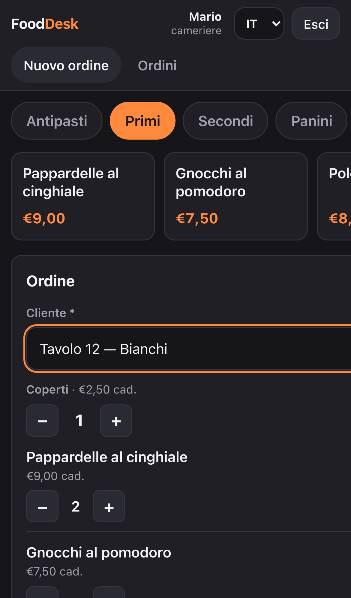
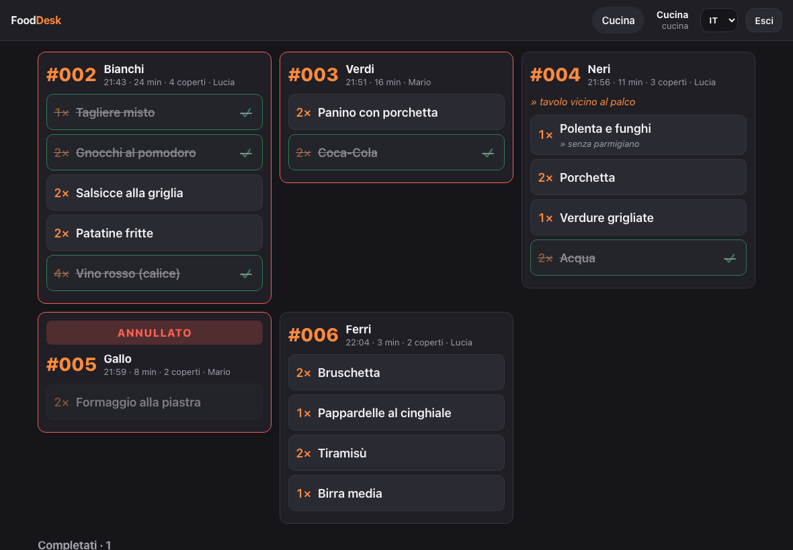
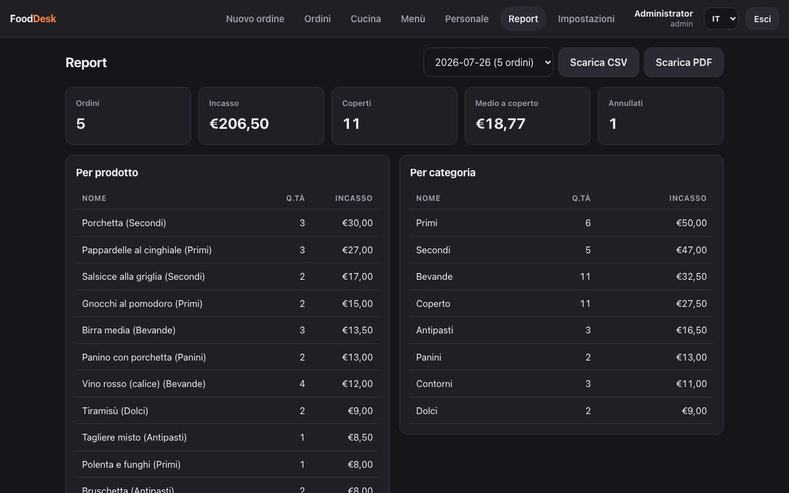
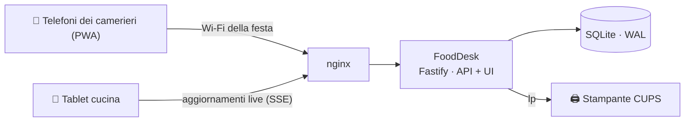

# FoodDesk

[](https://github.com/adefilippo83/FoodDesk/actions/workflows/ci.yml)
[](https://github.com/adefilippo83/FoodDesk/actions/workflows/codeql.yml)
[](https://github.com/adefilippo83/FoodDesk/releases)
[](deploy/README.md)
[](LICENSE)
[](https://codespaces.new/adefilippo83/FoodDesk)

**Il gestionale open source per sagre, feste di paese e ristoranti temporanei.**

Un piccolo computer sul Wi-Fi della festa sostituisce i blocchetti di carta:
i camerieri prendono le comande dal telefono, la cucina spunta i piatti su
un tablet, i ticket si stampano da soli e a fine serata i conti sono già
fatti. Niente cloud, niente abbonamenti, niente commissioni per ordine — i
dati restano sulla tua macchina.

*Prefer English? → [README.md](README.md)*

## Guardalo in azione

| Il telefono del cameriere | Il display cucina | I report di fine giornata |
|:---:|:---:|:---:|
|  |  |  |

## Provalo subito

- **Demo live — [fooddesk.fly.dev](https://fooddesk.fly.dev)**: un'istanza
  condivisa caricata con una serata di sagra di esempio, azzerata ogni 6
  ore. Quando è inattiva dorme: concedi qualche secondo alla prima
  richiesta. Account (password **fooddesk-demo** per tutti):

  | Utente | Ruolo |
  |---|---|
  | `admin` | amministratore |
  | `giulia` | caposala |
  | `mario`, `lucia` | camerieri |
  | `cucina` | display cucina |

  Aprila su due dispositivi insieme: prendi un ordine come `mario` e
  guardalo comparire all'istante sul display di `cucina`.

- **Un'istanza tutta tua, usa e getta**: clicca il badge *Open in GitHub
  Codespaces* qui sopra. Il codespace compila e avvia l'app e inoltra la
  porta 3000 su un URL HTTPS; entra con `admin / fooddesk-demo`.

## Pensato per tutta la squadra

**🧾 I camerieri** — una PWA nata per il telefono: tocchi i prodotti, conti
i coperti, aggiungi la nota per la cucina, invii. Il totale resta sempre
sotto il pollice, gli ordini sono numerati per giornata di servizio
(`#042`) e un singhiozzo di rete non può mai creare un ordine doppio. Un
piatto battuto per sbaglio si annulla da solo — totale e cucina si
aggiornano di conseguenza.

**🍳 La cucina** — un display su tablet che non richiede formazione: gli
ordini nuovi compaiono nell'istante in cui vengono inviati (senza mai
ricaricare la pagina), ogni piatto è un tap grande per segnarlo pronto,
l'ordine si completa da solo con l'ultimo piatto, e un ordine annullato
grida **ANNULLATO** invece di sparire in silenzio. Gli ordini in attesa da
troppo diventano rossi. Lo schermo resta acceso per tutto il servizio.

**🎩 Il caposala** — governa la sala con poteri quasi da amministratore:
menù, tutti gli ordini, annullamenti e report — ma niente pagina
Impostazioni, e sul personale gestisce solo gli account dei camerieri.

**⚙️ L'amministratore** — costruisce il menù (riordino a trascinamento,
eliminazioni soft che non rompono mai lo storico), gestisce personale e
ruoli, e disegna dal browser ogni documento stampato: scontrini e fogli
ordine con logo, intestazioni, dimensioni carattere, filigrana e formato
carta (rotolo termico 80mm compreso) in cinque lingue.

**📊 Chi fa i conti** — dashboard giornaliera in tempo reale (incasso,
coperti, medio a coperto, dettaglio per prodotto e categoria), CSV che si
apre corretto in Excel/LibreOffice e report PDF in una pagina. Gli ordini
annullati escono dai totali ma non spariscono mai dai registri.

**🖨 La stampa** — i ticket cucina vanno dritti a qualunque stampante CUPS
(termica o laser) con ristampa automatica se la stampante s'inceppa; senza
stampante subentra la finestra di stampa del browser. Scontrini e fogli
ordine sono veri PDF.

## Una serata alla sagra



Tutto gira su una sola macchina economica (un mini-PC o una scheda classe
Raspberry) sul Wi-Fi della festa. I telefoni installano FoodDesk come
un'app nativa direttamente dal browser. Il database è un singolo file
SQLite, fotografato ogni 15 minuti dal timer di backup incluso. Un ordine
preso all'1:30 di notte conta ancora per la serata in corso — i ristoranti
non finiscono a mezzanotte.

## Mettilo in funzione

**Docker — un comando:**

```bash
docker run -d --name fooddesk -p 3000:3000 -v fooddesk-data:/data \
  ghcr.io/adefilippo83/fooddesk:latest
docker logs fooddesk   # al primo avvio stampa la password admin generata
```

Ogni push su `main` pubblica `:edge`; ogni tag `v*` pubblica `:latest` e
`:X.Y.Z` (amd64 + arm64). Per stampare dal container imposta
`KITCHEN_PRINTER` più `CUPS_SERVER=<host>`. Per la guida completa al server
della festa — compose, stampa, backup, aggiornamenti — vedi
[deploy/README.md](deploy/README.md). A ogni pull request
l'immagine viene compilata **e avviata davvero**: lo smoke test della CI
aspetta `/api/health` e fa un login reale prima che qualcosa possa essere
pubblicato.

**Server Debian della festa — uno script:** vedi
[deploy/README.md](deploy/README.md). `sudo deploy/install.sh` è
idempotente e configura utente di sistema, servizio systemd blindato, nginx
e backup ogni 15 minuti. Aggiornare è `git pull && sudo deploy/install.sh`.

**Sviluppo locale:**

```bash
npm install
npm run migrate   # crea/aggiorna il database
npm run seed      # crea l'account admin (stampa la password)
npm run dev       # API su :3000, UI su :5173
npm test          # 105 test server; `npm run test:e2e` per lo smoke test browser
```

## Configurazione

| Variabile | Default | Scopo |
|---|---|---|
| `DATABASE_FILE` | `./data/fooddesk.db` | Posizione del file SQLite |
| `PORT` / `HOST` | `3000` / `0.0.0.0` | Ascolta su tutte le interfacce, per i telefoni |
| `COOKIE_SECURE` | `false` | Metti `true` dietro TLS |
| `ADMIN_USERNAME` / `ADMIN_PASSWORD` | `admin` / generata | Credenziali admin al seed. Impostando `ADMIN_PASSWORD` e rilanciando il seed su un database esistente, la password admin viene reimpostata (recupero d'emergenza) |
| `KITCHEN_PRINTER` | non impostata | Nome della coda CUPS (`lpstat -p` le elenca). Assente ⇒ stampa dal browser |
| `RESTAURANT_NAME` | `FoodDesk` | Intestazione predefinita — la pagina Impostazioni la sovrascrive |
| `PDF_LANG` | `it` | Lingua predefinita dei documenti (it/en/es/fr/pt) — Impostazioni sovrascrive |
| `CURRENCY_SYMBOL` | `€` | Simbolo di valuta su scontrini e totali |
| `SERVICE_DAY_CUTOFF_HOUR` | `5` | Gli ordini prima di quest'ora contano per la giornata precedente |

## Sotto il cofano

TypeScript da cima a fondo · Fastify · SQLite via Drizzle (WAL) · React 19
PWA · pdfkit + CUPS. Principi che il codice fa rispettare davvero:

- **I soldi sono centesimi interi.** Nessun float nel percorso del denaro, e
  i prezzi arrivano sempre dal database: un client manomesso non può farsi
  lo sconto.
- **La storia è immutabile.** Le righe d'ordine fotografano nome, prezzo e
  categoria; le eliminazioni sono soft; ordini e singoli piatti si
  annullano con traccia di audit, mai cancellati. Gli scontrini di ieri
  sopravvivono alle modifiche al menù di oggi.
- **L'autorizzazione vive sul server.** Ogni rotta è protetta
  (`src/auth/acl.ts`); la UI che nasconde le pagine admin è solo cosmesi e
  `test/acl.test.ts` è il contratto vero.
- **Blindato di serie**: password scrypt, login a tempo costante, blocco
  anti-bruteforce, revoca sessioni al cambio/reset password, CSP + security
  header, controllo Origin sulle scritture, limiti severi sui body,
  validazione dei magic byte delle immagini, invio ordini idempotente.
- **Cinque lingue** (it/en/es/fr/pt) con un dizionario tipizzato che il
  compilatore mantiene completo; il formato dei prezzi segue la lingua.

## CI/CD

Ogni push e PR esegue i test (105 server + smoke Playwright end-to-end),
ESLint, la build completa su Node 24 e 26, CodeQL e una build dell'immagine
Docker che viene davvero avviata e autenticata. Il tag `v*` pubblica una
Release GitHub con tarball installabile più le immagini container
versionate; ogni merge su `main` rideploya la
[demo live](https://fooddesk.fly.dev). Dependabot aggiorna le dipendenze
ogni settimana.

## Licenza

FoodDesk è software libero, rilasciato sotto
[GNU General Public License v3.0](LICENSE): puoi usarlo, studiarlo,
modificarlo e ridistribuirlo, ma i lavori derivati devono restare sotto la
stessa licenza.
