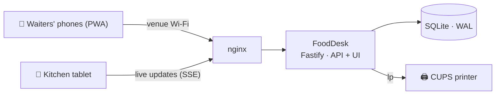

# FoodDesk

[](https://github.com/adefilippo83/FoodDesk/actions/workflows/ci.yml)
[](https://github.com/adefilippo83/FoodDesk/actions/workflows/codeql.yml)
[](https://github.com/adefilippo83/FoodDesk/releases)
[](deploy/README.md)
[](LICENSE)
[](https://codespaces.new/adefilippo83/FoodDesk)

**The open-source ordering system for food festivals, pop-up restaurants and community kitchens.**

One small computer on the venue Wi-Fi replaces the paper pads: waiters take
orders on their phones, the kitchen ticks off dishes on a tablet, tickets
print themselves, and at the end of the night the numbers are already added
up. No cloud, no subscription, no per-order fees — your data stays on your
own machine.

*Preferisci l'italiano? → [README.it.md](README.it.md)*

## See it in action

| Waiter's phone | Kitchen display | End-of-day reports |
|:---:|:---:|:---:|
|  |  |  |

## Try it right now

- **Live demo — [fooddesk.fly.dev](https://fooddesk.fly.dev)**: a shared
  instance loaded with a sample festival evening, reset every 6 hours. It
  sleeps when idle, so give the first request a few seconds. Accounts
  (password **fooddesk-demo** for all):

  | Username | Role |
  |---|---|
  | `admin` | admin |
  | `giulia` | maître d' |
  | `mario`, `lucia` | waiters |
  | `cucina` | kitchen display |

  Open it on two devices at once — take an order as `mario`, watch it appear
  instantly on `cucina`'s display.

- **Your own throwaway instance**: click the *Open in GitHub Codespaces*
  badge above. The codespace builds and starts the app and forwards port
  3000 to an HTTPS URL; sign in with `admin / fooddesk-demo`.

## Built for the whole crew

**🧾 Waiters** — a phone-first PWA: tap products, count covers (coperto),
add kitchen notes, send. The total stays under your thumb, orders are
numbered per service day (`#042`), and a network hiccup can never create a
duplicate order. Fix a mis-tap by cancelling a single line — totals and the
kitchen update themselves.

**🍳 The kitchen** — a tablet display that needs no training: new orders
appear the moment they are sent (server-sent events, no refreshing), each
dish is one big tap to mark done, orders complete themselves with the last
dish, and a cancelled order shouts **CANCELLED** instead of silently
vanishing. Orders waiting too long turn red. The screen stays awake through
the whole shift.

**🎩 The maître d'** — runs the room with almost-admin powers: the menu,
every order, cancellations and reports — but no settings page, and staff
management limited to waiter accounts.

**⚙️ The admin** — builds the menu (drag to reorder, soft-delete so history
never breaks), manages staff and roles, and styles every printed document
from the browser: receipts and order sheets with logo, header/footer text,
font sizes, watermark, paper size (80mm thermal roll included) in five
languages.

**📊 The treasurer** — live daily dashboard (revenue, covers, average per
cover, per-product and per-category breakdowns) plus CSV that opens
correctly in Excel/LibreOffice and a one-page PDF report. Cancelled orders
are excluded from the totals but never hidden from the books.

**🖨 Printing** — kitchen tickets go straight to any CUPS printer (thermal
or laser) with automatic retry when the printer jams; without a printer, the
browser's print dialog steps in. Receipts and order sheets are proper PDFs.

## A night at the venue



Everything runs on one inexpensive box (a mini-PC or Raspberry-class board)
on the venue's Wi-Fi. Phones install FoodDesk like a native app straight
from the browser. The database is a single SQLite file, snapshotted every 15
minutes by the bundled backup timer. An order taken at 1:30 AM still counts
for tonight's service day — restaurants don't end at midnight.

## Run it

**Docker — one command:**

```bash
docker run -d --name fooddesk -p 3000:3000 -v fooddesk-data:/data \
  ghcr.io/adefilippo83/fooddesk:latest
docker logs fooddesk   # the generated admin password is printed on first start
```

Every push to `main` publishes `:edge`; every `v*` tag publishes `:latest`
and `:X.Y.Z` (amd64 + arm64). For printing from the container, set
`KITCHEN_PRINTER` plus `CUPS_SERVER=<host>`. For the full venue walkthrough
— compose file, printing, backups, updates — see
[deploy/README.md](deploy/README.md). On every pull
request the image is built **and booted**: the CI smoke test waits for
`/api/health` and performs a real login before anything may be published.

**Raspberry Pi — flash and go:** every release ships
`fooddesk-rpi-<version>.img.xz`. Flash it, power the Pi, join the
**FoodDesk** Wi-Fi it creates, open `http://10.42.0.1/`. Works with no
internet (connectivity checks are answered locally), auto-configures USB
printers, and writes the generated credentials plus a printable QR leaflet
to the SD card's boot partition. Full guide: [rpi/README.md](rpi/README.md).

**Debian venue server — one script:** see [deploy/README.md](deploy/README.md).
`sudo deploy/install.sh` is idempotent and sets up the system user, the
hardened systemd service, nginx and 15-minute backups. Updating is
`git pull && sudo deploy/install.sh`.

**Local development:**

```bash
npm install
npm run migrate   # create/upgrade the database
npm run seed      # create the admin account (prints the password)
npm run dev       # API on :3000, UI on :5173
npm test          # 105 server tests; `npm run test:e2e` for the browser smoke test
```

## Configuration

| Variable | Default | Purpose |
|---|---|---|
| `DATABASE_FILE` | `./data/fooddesk.db` | SQLite file location |
| `PORT` / `HOST` | `3000` / `0.0.0.0` | Binds all interfaces so phones can reach it |
| `COOKIE_SECURE` | `false` | Set `true` when served over TLS |
| `ADMIN_USERNAME` / `ADMIN_PASSWORD` | `admin` / generated | Seed-time admin credentials. Setting `ADMIN_PASSWORD` and re-running the seed on an existing database resets the admin password (emergency recovery) |
| `KITCHEN_PRINTER` | unset | CUPS queue name (`lpstat -p` lists queues). Unset ⇒ browser print dialog fallback |
| `RESTAURANT_NAME` | `FoodDesk` | Default receipt header — the Settings page overrides this |
| `PDF_LANG` | `it` | Default document language (it/en/es/fr/pt) — Settings overrides |
| `CURRENCY_SYMBOL` | `€` | Currency symbol on receipts and totals |
| `SERVICE_DAY_CUTOFF_HOUR` | `5` | Orders before this hour count as the previous service day |
| `KIOSK_AUTOLOGIN_USER` | unset | Kitchen-role account auto-logged-in via `/api/auth/kiosk` — loopback-only, for an attached kiosk display ([rpi/README.md](rpi/README.md)) |

## Under the hood

TypeScript end to end · Fastify · SQLite via Drizzle (WAL) · React 19 PWA ·
pdfkit + CUPS. Principles the codebase actually enforces:

- **Money is integer cents.** No floats anywhere in the money path, and
  prices always come from the database — a tampered client cannot discount.
- **History is immutable.** Order lines snapshot name, price and category;
  deletes are soft; orders and single lines are cancelled with an audit
  trail, never erased. Yesterday's receipts survive today's menu edits.
- **Authorization lives on the server.** Every route is guarded
  (`src/auth/acl.ts`); the UI hiding admin screens is cosmetic and
  `test/acl.test.ts` is the real contract.
- **Hardened by default**: scrypt passwords, timing-equalized login, login
  lockout, session eviction on password change/reset/disable, CSP + security
  headers, Origin check on writes, strict body limits, image magic-byte
  validation, idempotent order submission.
- **Five languages** (it/en/es/fr/pt) via a typed dictionary the compiler
  keeps complete; money formatting follows the language.

## CI/CD

Every push and PR runs tests (105 server + Playwright e2e smoke), ESLint,
the full build on Node 24 and 26, CodeQL, and a Docker image build that is
actually booted and logged into. Tagging `v*` publishes a GitHub Release
with a deployable tarball plus versioned container images; every merge to
`main` redeploys the [live demo](https://fooddesk.fly.dev). Dependabot keeps
dependencies fresh weekly.

## License

FoodDesk is free software, released under the
[GNU General Public License v3.0](LICENSE): you may use, study, modify and
redistribute it, but derivative works must stay under the same license.
